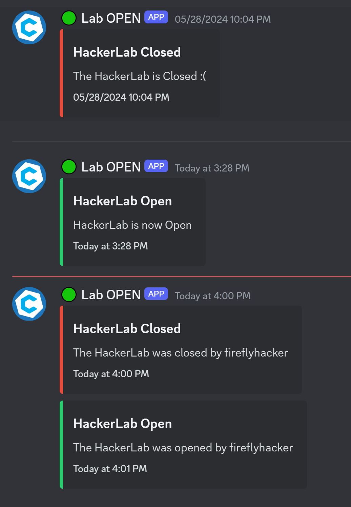

# HackerLab @ UCI Room Alert Switch
Physical switch connected to a Discord bot to alert people in the Cyber@UCI Discord when the room is open. 

### Why change it?
Why not?

### Usage
Flip switch "On" to send a discord message alerting people the room is open. Flip switch "Off" to send a message alerting people that the room is closed. 

### Indicator Light Behavior
* When operating correctly, only one light should be on at a time. The lights will ONLY change once a message has successfully been posted to discord.
* Blinking:
    * There should be a double blink on startup to indicate that the program has begun execution. 
    * On errors, they blink. If there's a lost network connection, or discord's servers are down, or anything else has caused several errors to rack up, the lights should alert the user that something's not right. 

### FAQ
#### Why was it (re)designed the way it was?
We had 2 different systems that I wanted to integrate. We had a room alert system where we had to enter commands manually to open/close the room, and then the HackerLab was gifted the hardware from IEEE which has a switch and used a webhook to send messages to a channel. I wanted to combine the ideas taking things like the open/closed status from the discord bot and combining it with the switch. 

#### How does it work?
The design philosophy behind this was that I wanted it to be able to go on running as long as possible without any maintenance on the actual device. I predict that this is going to sit on the network long after I leave UCI, and nobody's going to really touch it as long as it keeps working. 

It runs on a Raspberry Pi Zero W, connected to Wifi. The electronics are really simple; it's really only a toggle switch, 2 LEDs, and a buck converter for DC step-down. It runs off ~12VDC, which was done for ease of use and because we 
had plenty of 12V power supplies with 2.1mm barrel jacks. 

##### What about the code?
It is a discord.py based bot that to sends messages using the discord api, which means the connection is sort of asynchronous. It will consistently reach out to discord so if it breaks or goes offline the bot will show offline. 

However, I did not worry about edge cases:
* What about when the WiFi drops out and it loses connection?
* What if the internet goes out and it can't send the message?
* What if discord's servers are down, how do I prevent it spamming API requests and getting IP banned?
* What if someone flips the switch a bunch of times really quickly?
* What if people are going in and out of the room and the image gets timed out but the messages and status still get sent?
 
Some features include:
* The LEDs change state on successful posting of a message. If you flip the switch "ON", the LEDs won't switch from green to red until the room open message is posted.

What the messages look like posted to discord. 

(the "room closed" followed right by "room open" are caused by people playing with the switch, and not any actual error in the hardware or software)

##### Why use a physical switch instead of something like a motion/PIR sensor?
I've been asked this a few times, so I figured I'd explain the reasoning here. 
First off, the physical switch was a conscious design choice, for a few reasons 
1. the sensor would be fine for sending the "room open" message, but it would also have to send the "room closed" message. The only way I've seen to do this reliably is to check for motion periodically, and after a certain time frame with no movement send the "closed" alert. This isn't really acceptable from a user trust standpoint, since there will be time when the last message in the channel is wrong, and says that the room is open when it isn't. If someone comes in that 15 minutes or so after the room closed and sees that it's not open, that significantly reduces trust in the system since it, by design, wouldn't always be accurate. 
2. In a similar vein, if someone's coming in to the room just to grab something quick and isn't planning on staying, the PIR will send the "room open" alert but the room won't actually be open by the time anybody shows up
3. One of the main purposes of the project was to make it so people didn't have to message "is the room open" to see if anyone's there. If every time it's used there's a window where the message is wrong, the alert is unreliable, it'll be back to messaging to ask if it's open.
4. Also, some PIR sensors can be buggy and not super reliable. it might just not detect when someone's there; it might detect a bug moving around or something left on that's warm as a person, and think that someone's there when they aren't.
5. In my personal opinion, "smarter" devices aren't always better. Keeping things simple, reliable, and trustworthy is more advantageous over a system that might require less "direct" user interaction, but adds significant complexity and room for error.

## What if I want to build my own?
### Installation & Configuration
* Extract & Install repo on pi. Install all dependencies (requirements.txt hopefully coming soon).
* You need to rename `creds_CHANGEME.py` to `_creds_.py` and add your discord bot ID, Server ID, and bot token to the file. 

### General Info
* Firewall rules should be configured to only allow inbound SSH.
* Automatic updates should be configured with `unattended-upgrade` to allow for autonomous operation. 
* The service should be daemonized in your init system (I used `systemd`), and set to start up on boot and auto-restart itself in case of issues. 

